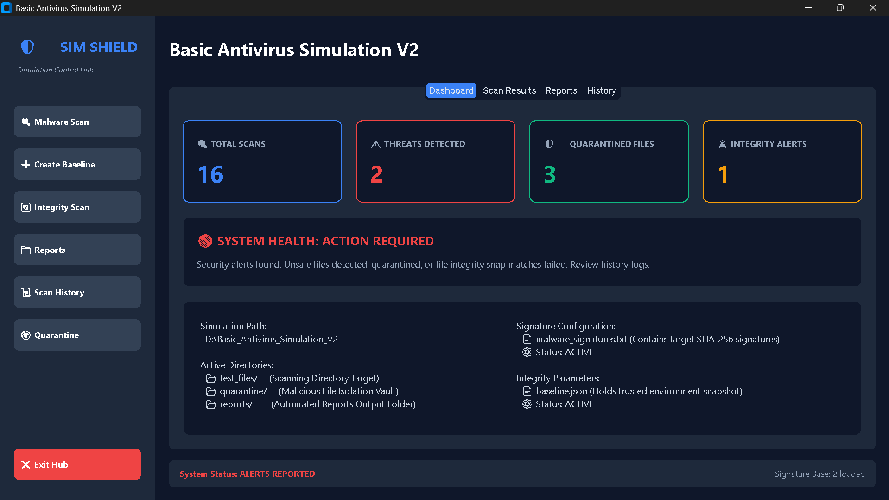
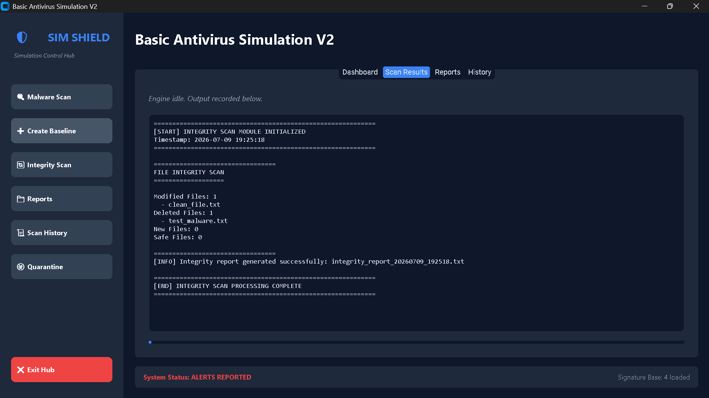
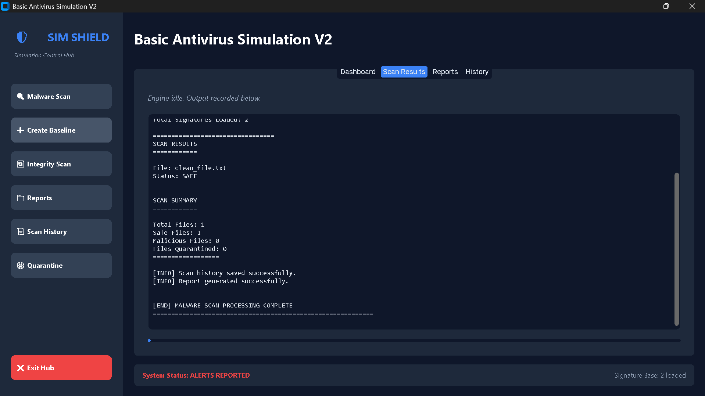
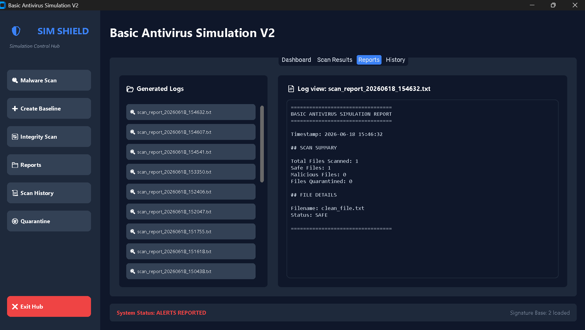
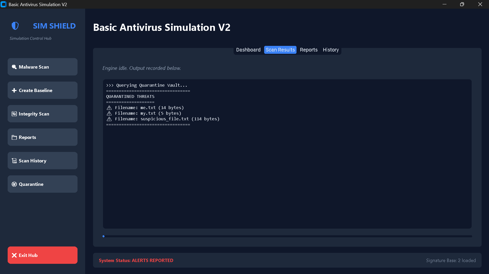
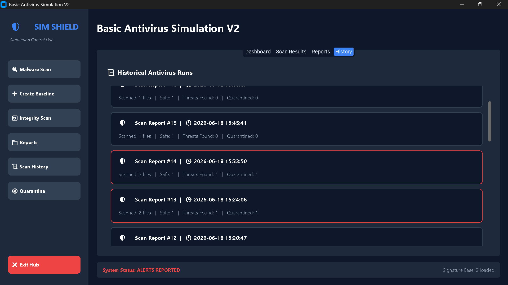

<h1 align="center">
  <br>
  
  <br>
  ShieldHub – Basic Antivirus Simulation
  <br>
</h1>

<h4 align="center">
A Python-based desktop application that simulates core Endpoint Security concepts including Signature-Based Malware Detection and File Integrity Monitoring (FIM).
</h4>

<p align="center">
  
  
  
  
</p>

---

# 📖 Overview

**ShieldHub – Basic Antivirus Simulation** is an educational cybersecurity project built entirely in **Python** to demonstrate how traditional antivirus software detects known threats using **SHA-256 signature matching** and monitors unauthorized file modifications through **File Integrity Monitoring (FIM)**.

The application features a modern **CustomTkinter GUI** and provides hands-on experience with core endpoint security concepts used by SOC Analysts, Blue Teams, and Security Engineers.

---

# ✨ Features

## 🛡 Signature-Based Malware Detection

- Calculates SHA-256 hashes of files
- Compares hashes with a local malware signature database
- Detects known malicious files
- Automatically quarantines detected files
- Generates detailed scan reports

---

## 🔍 File Integrity Monitoring (FIM)

- Creates a trusted baseline of monitored files
- Detects:
  - Modified files
  - Deleted files
  - Newly created files
- Generates integrity monitoring reports

---

## 💻 Modern GUI

- Built using CustomTkinter
- Responsive interface
- Dark theme
- Easy-to-use controls
- Scan history support
- Background processing for smooth performance

---

# 📸 Screenshots


### Dashboard



### Malware Detection


### File Integrity Monitoring




### Baseline Creation



### Reports



### Quarantine Report



### Scan History



---

# 🛠 Technologies Used

- Python 3.13
- CustomTkinter
- hashlib
- shutil
- threading
- pathlib
- json
- os
- datetime

---

# 🏗 Project Architecture

```
                User
                  │
                  ▼
           CustomTkinter GUI
                  │
        ┌─────────┴─────────┐
        │                   │
        ▼                   ▼
 Signature Scanner     Integrity Monitor
        │                   │
        ▼                   ▼
 SHA-256 Hashing      Baseline Comparison
        │                   │
        ▼                   ▼
 Malware Database     Detect File Changes
        │                   │
        └─────────┬─────────┘
                  ▼
          Generate Reports
                  │
                  ▼
        Quarantine Malicious Files
```

---

# 📂 Project Structure

```
Basic-Antivirus-Simulation/
│
├── assets/                         # Project screenshots
│
├── quarantine/
│   └── .gitkeep
│
├── reports/
│   └── .gitkeep
│
├── test_files/
│   ├── clean_file.txt
│   └── test_malware.txt
│
├── gui.py                          # Main GUI
├── scanner.py                      # Signature-based scanner
├── integrity_monitor.py            # File Integrity Monitoring
├── malware_signatures.txt          # Malware signature database
├── requirements.txt
├── README.md
├── .gitignore
└── LICENSE
```

---

# ⚙ Installation

## Clone the repository

```bash
git clone https://github.com/likhith-h-l/Basic-Antivirus-Simulation.git
cd Basic-Antivirus-Simulation
```

---

## Create Virtual Environment

### Windows

```bash
python -m venv venv
venv\Scripts\activate
```

### Linux/macOS

```bash
python3 -m venv venv
source venv/bin/activate
```

---

## Install Dependencies

```bash
pip install -r requirements.txt
```

---

## Run the Application

```bash
python gui.py
```

---

# 🚀 How It Works

## 1. Signature-Based Detection

The scanner calculates the SHA-256 hash of each file and compares it with known malicious hashes stored in:

```
malware_signatures.txt
```

If a match is found:

- Malware Detected
- File Quarantined
- Report Generated

---

## 2. File Integrity Monitoring

The application creates a **Baseline** by storing trusted SHA-256 hashes.

During future scans it compares:

- Current hash
- Baseline hash

If differences exist, it reports:

- Modified Files
- Deleted Files
- Newly Added Files

---

# 📄 Generated Reports

The application automatically creates reports inside:

```
reports/
```

Including:

- Malware Scan Reports
- File Integrity Reports

---

# 🧪 Testing

Test the following features:

- GUI Launch
- Normal File Scan
- Malware Detection
- Quarantine
- Report Generation
- Create Baseline
- Integrity Monitoring
- Modified File Detection
- Error Handling

---

# 📚 What I Learned

Through this project I gained practical experience with:

- SHA-256 Hashing
- Signature-Based Detection
- File Integrity Monitoring
- Python GUI Development
- Secure File Handling
- Report Generation
- Multithreading
- JSON Data Storage
- Cybersecurity Fundamentals

---

# 🚀 Future Improvements

- YARA Rule Integration
- VirusTotal API Integration
- Real-Time File Monitoring
- Scheduled Automatic Scans
- Cloud-Based Signature Updates
- Multi-threaded File Scanning
- Email Alert Notifications
- Threat Intelligence Integration

---

# 🎯 Use Cases

- Cybersecurity Learning
- Python Practice
- Portfolio Project
- SOC Analyst Demonstration
- File Integrity Monitoring Demo
- Antivirus Simulation

---

# 📜 License

This project is licensed under the **MIT License**.

---

# 👨‍💻 Author

**Likhith H L**

Cybersecurity Student | AI-Integrated SOC Analyst | Cloud Security Enthusiast

GitHub: https://github.com/likhith-h-l

---

⭐ If you found this project useful, consider giving it a star!
